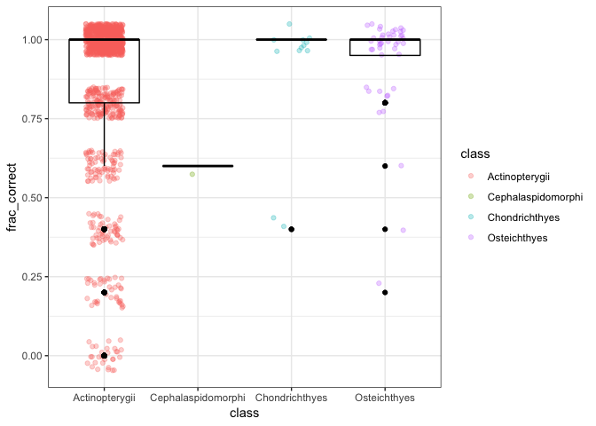

Autoarima report
================
Hao Ye
2019-02-26

## Read in the results

``` r
# define where the cache is located
db <- DBI::dbConnect(RSQLite::SQLite(), here::here("output", "drake-cache.sqlite"))
cache <- storr::storr_dbi("datatable", "keystable", db)

results_list <- readd(results_autoarima, cache = cache)
```

## Process results together

Here, `results_list` is a list with 8 elements, one for each of the
datasets that were analyzed. Each individual element is a tibble with
the same list columns, `results` and `metadata`.

``` r
str(results_list, max.level = 2)
```

    ## List of 8
    ##  $ analysis_autoarima_data_.salmon.             :Classes 'tbl_df', 'tbl' and 'data.frame':   1 obs. of  2 variables:
    ##   ..$ results :List of 1
    ##   ..$ metadata:List of 1
    ##  $ analysis_autoarima_data_.RAMlegacy_catch.    :Classes 'tbl_df', 'tbl' and 'data.frame':   1 obs. of  2 variables:
    ##   ..$ results :List of 1
    ##   ..$ metadata:List of 1
    ##  $ analysis_autoarima_data_.RAMlegacy_ssb.      :Classes 'tbl_df', 'tbl' and 'data.frame':   1 obs. of  2 variables:
    ##   ..$ results :List of 1
    ##   ..$ metadata:List of 1
    ##  $ analysis_autoarima_data_.RAMlegacy_recperssb.:Classes 'tbl_df', 'tbl' and 'data.frame':   1 obs. of  2 variables:
    ##   ..$ results :List of 1
    ##   ..$ metadata:List of 1
    ##  $ analysis_autoarima_data_.Dorner2008.         :Classes 'tbl_df', 'tbl' and 'data.frame':   1 obs. of  2 variables:
    ##   ..$ results :List of 1
    ##   ..$ metadata:List of 1
    ##  $ analysis_autoarima_data_.LPI.                :Classes 'tbl_df', 'tbl' and 'data.frame':   1 obs. of  2 variables:
    ##   ..$ results :List of 1
    ##   ..$ metadata:List of 1
    ##  $ analysis_autoarima_data_.SprSum_Col_Chinook. :Classes 'tbl_df', 'tbl' and 'data.frame':   1 obs. of  2 variables:
    ##   ..$ results :List of 1
    ##   ..$ metadata:List of 1
    ##  $ analysis_autoarima_data_.PugSound_Chinook.   :Classes 'tbl_df', 'tbl' and 'data.frame':   1 obs. of  2 variables:
    ##   ..$ results :List of 1
    ##   ..$ metadata:List of 1

First, we combine these results together into a single tibble, making
sure to keep the name of the original dataset, and doing some cleaning
of the dataset names:

``` r
results <- bind_rows(results_list, .id = "dataset") %>%
    mutate(dataset = sub("analysis_.+_data_\\.(.+)\\.", "\\1", dataset))
```

To facilitate combining results from different datasets, we’re going to
grab the `species_table` from within the `metadata` column, and join it
with the results:

``` r
# function to combine elements from the three columns
process_row <- function(dataset, results, metadata) {
    results %>%
        mutate(dataset = dataset) %>%
        left_join(mutate(metadata$species_table, id = as.character(id), 
                         by = "id"))
}

# apply process_row to each dataset, then combine into a single tibble
out <- results %>%
    pmap(process_row) %>%
    bind_rows()
```

    ## Joining, by = "id"
    ## Joining, by = "id"
    ## Joining, by = "id"
    ## Joining, by = "id"
    ## Joining, by = "id"
    ## Joining, by = "id"
    ## Joining, by = "id"
    ## Joining, by = "id"

``` r
# what is the structure of out?
str(out)
```

    ## 'data.frame':    6286 obs. of  10 variables:
    ##  $ observed : num  10.5 10.5 11.2 11.2 11 ...
    ##  $ predicted: num  9.66 9.8 9.87 9.9 9.92 ...
    ##  $ lower_95 : num  8.34 8.45 8.5 8.53 8.54 ...
    ##  $ upper_95 : num  11 11.2 11.2 11.3 11.3 ...
    ##  $ id       : chr  "62" "62" "62" "62" ...
    ##  $ method   : chr  "autoarima_ts" "autoarima_ts" "autoarima_ts" "autoarima_ts" ...
    ##  $ dataset  : chr  "salmon" "salmon" "salmon" "salmon" ...
    ##  $ species  : Factor w/ 193 levels "Allocyttus niger",..: 21 21 21 21 21 21 21 21 21 21 ...
    ##  $ class    : Factor w/ 4 levels "Actinopterygii",..: 1 1 1 1 1 1 1 1 1 1 ...
    ##  $ by       : chr  "id" "id" "id" "id" ...

## Prepare for plotting

What we want to plot is a summary of the results for each time series
(represented by unique combinations of `id` x `dataset`). Since the
observed and predicted values are going to have very different scales
across each time series, let’s just count the fraction of times the
observed value fell within the predicted 95% range:

``` r
to_plot <- out %>%
    group_by(id, dataset) %>%
    summarize(frac_correct = sum(observed > lower_95 & observed < upper_95) / n(), 
              species = first(species), 
              class = first(class))
```

## Plot

For each level of `class`, produce a histogram for `frac_correct`:

``` r
ggplot(data = to_plot, 
       mapping = aes(x = frac_correct, fill = class)) + 
    facet_wrap(~class, scales = "free_y") + 
    geom_bar(width = 0.15)
```

    ## Warning: Removed 12 rows containing non-finite values (stat_count).

<!-- -->
