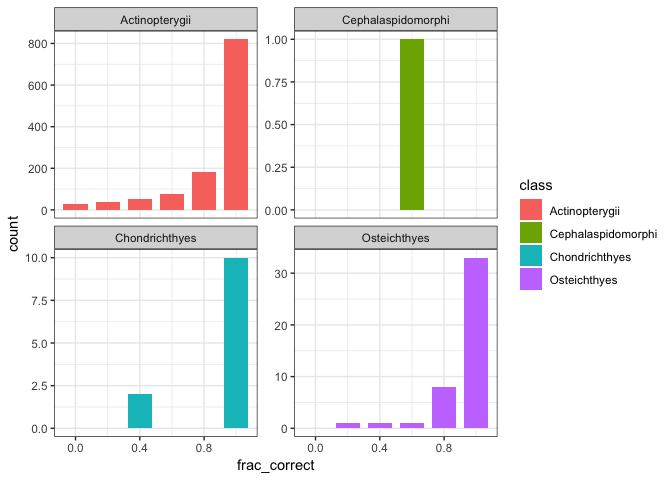

autoarima report
================
Hao Ye
2019-03-22

## Read in the results

``` r
# define where the cache is located
db <- DBI::dbConnect(RSQLite::SQLite(), here::here("output", "drake-cache.sqlite"))
cache <- storr::storr_dbi("datatable", "keystable", db)

results_autoarima <- readd(results_autoarima, character_only = FALSE, cache = cache)
```

## Process results together

Here, `results_autoarima` is a list with 8 elements, one for each of the
datasets that were analyzed. Each individual element is a tibble with
the same list columns, `results` and `metadata`.

``` r
str(results_autoarima, max.level = 2)
```

    ## List of 8
    ##  $ analysis_autoarima_data_.salmon.             :Classes 'tbl_df', 'tbl' and 'data.frame':   1 obs. of  5 variables:
    ##   ..$ results :List of 1
    ##   ..$ metadata:List of 1
    ##   ..$ dataset : chr "data_.salmon."
    ##   ..$ method  : chr "arima_fracdiff_ts"
    ##   ..$ args    :List of 1
    ##  $ analysis_autoarima_data_.RAMlegacy_catch.    :Classes 'tbl_df', 'tbl' and 'data.frame':   1 obs. of  5 variables:
    ##   ..$ results :List of 1
    ##   ..$ metadata:List of 1
    ##   ..$ dataset : chr "data_.RAMlegacy_catch."
    ##   ..$ method  : chr "arima_fracdiff_ts"
    ##   ..$ args    :List of 1
    ##  $ analysis_autoarima_data_.RAMlegacy_ssb.      :Classes 'tbl_df', 'tbl' and 'data.frame':   1 obs. of  5 variables:
    ##   ..$ results :List of 1
    ##   ..$ metadata:List of 1
    ##   ..$ dataset : chr "data_.RAMlegacy_ssb."
    ##   ..$ method  : chr "arima_fracdiff_ts"
    ##   ..$ args    :List of 1
    ##  $ analysis_autoarima_data_.RAMlegacy_recperssb.:Classes 'tbl_df', 'tbl' and 'data.frame':   1 obs. of  5 variables:
    ##   ..$ results :List of 1
    ##   ..$ metadata:List of 1
    ##   ..$ dataset : chr "data_.RAMlegacy_recperssb."
    ##   ..$ method  : chr "arima_fracdiff_ts"
    ##   ..$ args    :List of 1
    ##  $ analysis_autoarima_data_.Dorner2008.         :Classes 'tbl_df', 'tbl' and 'data.frame':   1 obs. of  5 variables:
    ##   ..$ results :List of 1
    ##   ..$ metadata:List of 1
    ##   ..$ dataset : chr "data_.Dorner2008."
    ##   ..$ method  : chr "arima_fracdiff_ts"
    ##   ..$ args    :List of 1
    ##  $ analysis_autoarima_data_.LPI.                :Classes 'tbl_df', 'tbl' and 'data.frame':   1 obs. of  5 variables:
    ##   ..$ results :List of 1
    ##   ..$ metadata:List of 1
    ##   ..$ dataset : chr "data_.LPI."
    ##   ..$ method  : chr "arima_fracdiff_ts"
    ##   ..$ args    :List of 1
    ##  $ analysis_autoarima_data_.SprSum_Col_Chinook. :Classes 'tbl_df', 'tbl' and 'data.frame':   1 obs. of  5 variables:
    ##   ..$ results :List of 1
    ##   ..$ metadata:List of 1
    ##   ..$ dataset : chr "data_.SprSum_Col_Chinook."
    ##   ..$ method  : chr "arima_fracdiff_ts"
    ##   ..$ args    :List of 1
    ##  $ analysis_autoarima_data_.PugSound_Chinook.   :Classes 'tbl_df', 'tbl' and 'data.frame':   1 obs. of  5 variables:
    ##   ..$ results :List of 1
    ##   ..$ metadata:List of 1
    ##   ..$ dataset : chr "data_.PugSound_Chinook."
    ##   ..$ method  : chr "arima_fracdiff_ts"
    ##   ..$ args    :List of 1

First, we combine these results together into a single tibble, making
sure to keep the name of the original dataset, and doing some cleaning
of the dataset names:

``` r
results_autoarima <- bind_rows(results_autoarima) %>%
    mutate(dataset = sub("data_\\.(.+)\\.", "\\1", dataset))

print(results_autoarima)
```

    ## # A tibble: 8 x 5
    ##   results               metadata   dataset          method         args    
    ##   <list>                <list>     <chr>            <chr>          <list>  
    ## 1 <data.frame [751 × 5… <list [2]> salmon           arima_fracdif… <list […
    ## 2 <data.frame [1,340 ×… <list [2]> RAMlegacy_catch  arima_fracdif… <list […
    ## 3 <data.frame [1,195 ×… <list [2]> RAMlegacy_ssb    arima_fracdif… <list […
    ## 4 <data.frame [1,070 ×… <list [2]> RAMlegacy_recpe… arima_fracdif… <list […
    ## 5 <data.frame [430 × 5… <list [2]> Dorner2008       arima_fracdif… <list […
    ## 6 <data.frame [1,280 ×… <list [2]> LPI              arima_fracdif… <list […
    ## 7 <data.frame [110 × 5… <list [2]> SprSum_Col_Chin… arima_fracdif… <list […
    ## 8 <data.frame [110 × 5… <list [2]> PugSound_Chinook arima_fracdif… <list […

To facilitate combining results from different datasets, we’re going to
grab the `species_table` from within the `metadata` column, and join it
with the results:

``` r
# function to combine elements from the three columns
process_row <- function(results, metadata, dataset, method, args) {
    results %>%
        mutate(dataset = dataset, 
               method = method, 
               args = list(args)) %>%
        left_join(mutate(metadata$species_table, id = as.character(id)), 
                  by = "id")
}

# apply process_row to each dataset, then combine into a single tibble
results <- results_autoarima %>%
    pmap(process_row) %>%
    bind_rows() %>%
    as_tibble()

# what is the structure of results?
print(results)
```

    ## # A tibble: 6,286 x 10
    ##    id    observed predicted lower_CI upper_CI dataset method args  species
    ##    <chr>    <dbl>     <dbl>    <dbl>    <dbl> <chr>   <chr>  <lis> <fct>  
    ##  1 62       10.5       9.66     8.34     11.0 salmon  arima… <lis… Chinook
    ##  2 62       10.5       9.80     8.45     11.2 salmon  arima… <lis… Chinook
    ##  3 62       11.2       9.87     8.50     11.2 salmon  arima… <lis… Chinook
    ##  4 62       11.2       9.90     8.53     11.3 salmon  arima… <lis… Chinook
    ##  5 62       11.0       9.92     8.54     11.3 salmon  arima… <lis… Chinook
    ##  6 63        8.52      8.63     7.26     10.0 salmon  arima… <lis… Chinook
    ##  7 63        7.88      8.78     7.32     10.2 salmon  arima… <lis… Chinook
    ##  8 63        8.52      8.68     7.09     10.3 salmon  arima… <lis… Chinook
    ##  9 63        8.26      8.68     7.05     10.3 salmon  arima… <lis… Chinook
    ## 10 63        8.32      8.65     6.99     10.3 salmon  arima… <lis… Chinook
    ## # … with 6,276 more rows, and 1 more variable: class <fct>

## Prepare for plotting

What we want to plot is a summary of the results for each time series
(represented by unique combinations of `id` x `dataset`). Since the
observed and predicted values are going to have very different scales
across each time series, let’s just count the fraction of times the
observed value fell within the predicted 95% range:

``` r
to_plot <- results %>%
    group_by(id, dataset) %>%
    summarize(frac_correct = sum(observed > lower_CI & observed < upper_CI) / n(), 
              species = first(species), 
              class = first(class))
```

## Plot

For each level of `class`, produce a histogram for `frac_correct`:

``` r
ggplot(data = to_plot, 
       mapping = aes(x = frac_correct, fill = class)) + 
    facet_wrap(~class, scales = "free_y") + 
    geom_bar(width = 0.15) + 
    theme_bw()
```

    ## Warning: Removed 12 rows containing non-finite values (stat_count).

<!-- -->
