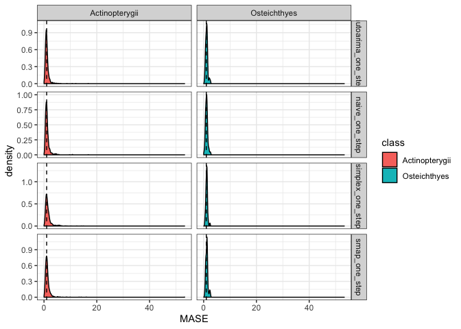

Forecasting Method Evaluation
================
Hao Ye
2019-07-30

## Read in the results

``` r
# define where the cache is located
db <- DBI::dbConnect(RSQLite::SQLite(), here::here("output", "drake-cache.sqlite"))
cache <- storr::storr_dbi("datatable", "keystable", db)

# load results
loadd(full_results, cache = cache)
```

## Examine the output structure

``` r
full_results
```

    ## # A tibble: 14 x 5
    ##    results          metadata       dataset           method        args    
    ##    <list>           <list>         <chr>             <chr>         <list>  
    ##  1 <df[,6] [1,770 … <named list [… data_salmon       autoarima_on… <list […
    ##  2 <df[,6] [4,175 … <named list [… data_RAMlegacy_c… autoarima_on… <list […
    ##  3 <df[,6] [3,587 … <named list [… data_RAMlegacy_s… autoarima_on… <list […
    ##  4 <df[,6] [3,219 … <named list [… data_RAMlegacy_r… autoarima_on… <list […
    ##  5 <df[,6] [1,083 … <named list [… data_Dorner2008   autoarima_on… <list […
    ##  6 <df[,6] [336 × … <named list [… data_SprSum_Col_… autoarima_on… <list […
    ##  7 <df[,6] [299 × … <named list [… data_PugSound_Ch… autoarima_on… <list […
    ##  8 <df[,5] [1,770 … <named list [… data_salmon       naive_one_st… <list […
    ##  9 <df[,5] [4,175 … <named list [… data_RAMlegacy_c… naive_one_st… <list […
    ## 10 <df[,5] [3,587 … <named list [… data_RAMlegacy_s… naive_one_st… <list […
    ## 11 <df[,5] [3,219 … <named list [… data_RAMlegacy_r… naive_one_st… <list […
    ## 12 <df[,5] [1,083 … <named list [… data_Dorner2008   naive_one_st… <list […
    ## 13 <df[,5] [336 × … <named list [… data_SprSum_Col_… naive_one_st… <list […
    ## 14 <df[,5] [299 × … <named list [… data_PugSound_Ch… naive_one_st… <list […

`full_results` is a tibble with 14 rows, corresponding to the
combinations of different `dataset` and `method`.

First, let’s do some cleaning of the dataset names:

``` r
full_results <- full_results %>%
        mutate(dataset = sub("data_(.+)$", "\\1", dataset))
```

If we had all of the results in one long-table, that would allows us to
then compute group summaries as we wish. Here, we can ignore the `args`
column, since we don’t specify any optional arguments to the methods
that we need to track.

### Merging results and metadata

Taking a look at the `results` and `metadata` columns:

``` r
head(full_results[[1, "results"]])
```

    ##   id observed predicted lower_CI upper_CI training_naive_error
    ## 1 62 10.18112  9.350246 8.005280 10.69521            0.5820469
    ## 2 62 10.22001 10.015382 8.646983 11.38378            0.6288405
    ## 3 62 10.93525 10.021401 8.672140 11.37066            0.6109633
    ## 4 62 10.80714 10.047511 8.684199 11.41082            0.6140301
    ## 5 62 10.59376 10.278505 8.947784 11.60923            0.6001467
    ## 6 62 10.12218 10.234645 8.919308 11.54998            0.5894032

``` r
head(full_results[[1, "metadata"]])
```

    ## $species_table
    ## # A tibble: 155 x 3
    ##       id species class         
    ##    <int> <fct>   <fct>         
    ##  1    62 Chinook Actinopterygii
    ##  2    63 Chinook Actinopterygii
    ##  3    64 Chinook Actinopterygii
    ##  4    65 Chinook Actinopterygii
    ##  5    66 Chinook Actinopterygii
    ##  6    67 Chinook Actinopterygii
    ##  7    68 Chinook Actinopterygii
    ##  8    69 Chinook Actinopterygii
    ##  9    70 Chinook Actinopterygii
    ## 10    71 Chinook Actinopterygii
    ## # … with 145 more rows
    ## 
    ## $timename
    ## [1] "year"

We might want the species information, so let’s join the `species_table`
element of `metadata` to each `results` df:

``` r
# function to combine elements from the three columns
process_row <- function(results, metadata, dataset, method, args) {
    results %>%
        mutate(dataset = dataset, 
               method = method, 
               args = list(args)) %>%
        left_join(mutate(metadata$species_table, id = as.character(id)), 
                  by = "id")
}

# apply process_row to each dataset, then combine into a single tibble
results <- full_results %>%
    pmap(process_row) %>%
    bind_rows() %>%
    as_tibble()
```

### Processing results

To compute Mean Absolute Scaled Error, we use the definition from
\[@Hyndman\_2019\]:

\[q_j = \frac{e_j}{\frac{1}{T-1}\sum_{t = 2}^T |y_t - y_t-1|}\]

and since the denominator is already computed for us as
`training_naive_error`, we need only compute `observed` - `predicted` to
get \(e_j\).

``` r
results <- results %>%
    mutate(error = observed - predicted)
```

We then need to summarize over each set of predictions:

``` r
summary_results <- results %>%
    group_by(dataset, method, id) %>%
    summarize(MASE = mean(abs(error) / training_naive_error), 
              species = first(species), 
              class = first(class))
```

## Plot

For each level of `class`, produce a histogram for `frac_correct`:

``` r
ggplot(data = summary_results, 
       mapping = aes(x = MASE, fill = class)) + 
    facet_grid(method~class, scales = "free_y") + 
    geom_density(position = "stack") + 
    geom_vline(aes(xintercept = 1), linetype = 2) + 
    theme_bw()
```

    ## Warning: Removed 24 rows containing non-finite values (stat_density).

<!-- -->

## Cleanup

``` r
DBI::dbDisconnect(db)
```
